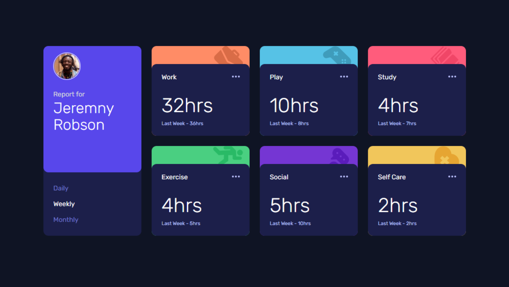

# Frontend Mentor - time tracking dashboard main solution

  <h3>
    <a href="https://fadelun.github.io/time-tracking-dashboard/">
      Live
    </a>
     | 
    <a href="https://www.frontendmentor.io/solutions/react-js-with-tailwind-Byw9ouDB5">
      Solution
    </a>
    | 
    <a href="https://www.frontendmentor.io/challenges">
      Challenge
    </a>
  </h3>

 

Challenge by <a href="https://www.frontendmentor.io/challenges/time-tracking-dashboard-UIQ7167Jw/hub/react-js-with-tailwind-Byw9ouDB5" target="_blank" >Frontend Mentor</a>. Coded by <a href="https://github.com/fadelun" >Muhammad Fadll</a>.

 
 
 
 
 
 

# Overview

## The challenge

Users should be able to:

- View the optimal layout for the site depending on their device's screen size
- See hover states for all interactive elements on the page
- Switch between viewing Daily, Weekly, and Monthly stats

## Built with

- Semantic HTML5 markup
- Mobile-first workflow
- [React](https://reactjs.org/) - JS library
- [Tailwindcss](https://tailwindcss.com) - css framework
